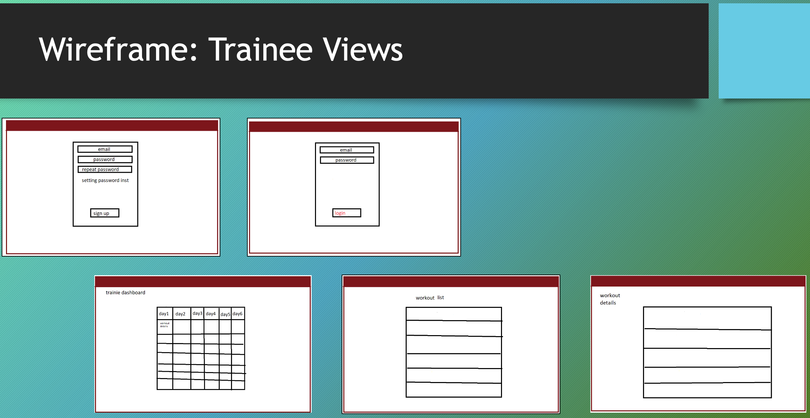

# Gymnazyo

## Date: 10/6/2024

### By:

#### Abdulla Hisham [Instagram](https://www.instagram.com/3abood23/?hl=en)| [GitHub](https://github.com/chupa1997) | [LinkedIn](www.linkedin.com/in/aboodisa)

#### Yusef Zaman [Instagram](https://www.instagram.com/yusefzaman?igsh=MXVrN20yZGZhNzRxMg==)| [GitHub](https://github.com/yusefzaman) | [LinkedIn](https://www.linkedin.com/in/yusefzaman)

#### Talal Alshwaier

---

### **Find Your Gym Trainer Today**

#### We are building an app that connects trainers and trainees, it allows instructors to create workouts and then create personalised weekly plans for each trainee.

---

## **_Technologies used_**

### - Front-end

#### - React 

### - Back-end

- MongoDB
- Express
- node.js
- Mongoose
- EJS
---
### **_Getting Started_**

##### Trainers and users can create an account using the sign-up page.

##### Trianers will then be navigated to a page where they can create workouts and personalised plans.

##### Trainees will then be navigated to a view where they can see their assigned workout plan details and click on each to get details.

---

### **_Wireframe_**

---

### **_ER Diagram_**

---

### **_Progress_**

#### You can see the project progress from [Trello](https://trello.com/b/E4j8M6Xn/unit-3-project-gymnas)

<!-- --- -->

<!-- ### **_Future Updates_**

#### Ability for users to 
#### 
#### -->

---

### **_Credits_**

---
