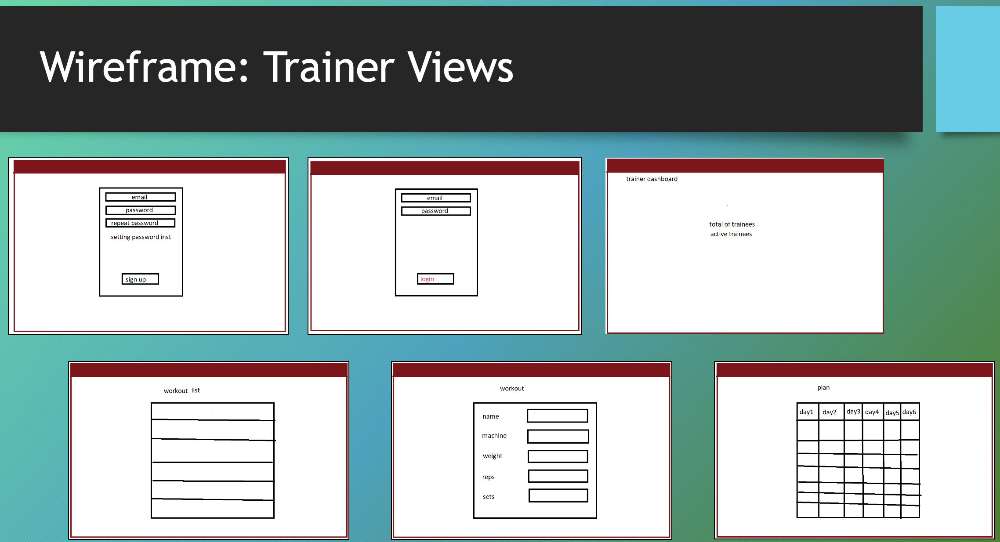

# Gymnazyo

## Date: 10/6/2024

### By:

#### Abdulla Hisham [GitHub](https://github.com/chupa1997) | [LinkedIn](www.linkedin.com/in/aboodisa)

#### Yusef Zaman [GitHub](https://github.com/yusefzaman) | [LinkedIn](https://www.linkedin.com/in/yusefzaman)

#### Talal Alshwaier [GitHub](https://github.com/Talal146) | [LinkedIn](https://www.linkedin.com/in/talal-alshwaier/)

---

### **_Description_**

#### We are building an app that connects trainers and trainees, it allows instructors to create workouts and then create personalised weekly plans for each trainee.

---

## **_Technologies used_**

### - Front-end

#### - React

### - Back-end

- MongoDB
- Express
- node.js
- Mongoose
- EJS

---

### **_Getting Started_**

##### Trainers and users can create an account using the sign-up page.

##### Trianers will then be navigated to a page where they can create workouts and personalised plans.

##### Trainees will then be navigated to a view where they can see their assigned workout plan details and click on each to get details.

### **_Wireframe_**

---

### **_ERD_**

---

### **_Progress_**

#### You can see the project progress from [Trello](https://trello.com/b/E4j8M6Xn/unit-3-project-gymnas)

---

### **_Future Updates_**

1)	Integration with an AI chatbot to recommend workout plans and diet recommendations

2)	The ability to connect with gyms to that your workout plan is synced to their system and any trainer can train you with that gym plan rather than only one trainer and gym.

3)	A meal plan service that will allow the user to connect with grocery stores to order what they will need to make those meals.

---

### **_Credits_**
All credits go to the talented and dedicated teaching staff of GA Bahrain for enabling us and empowering us with the knowledge and skills to create a MERN stack app.

---
